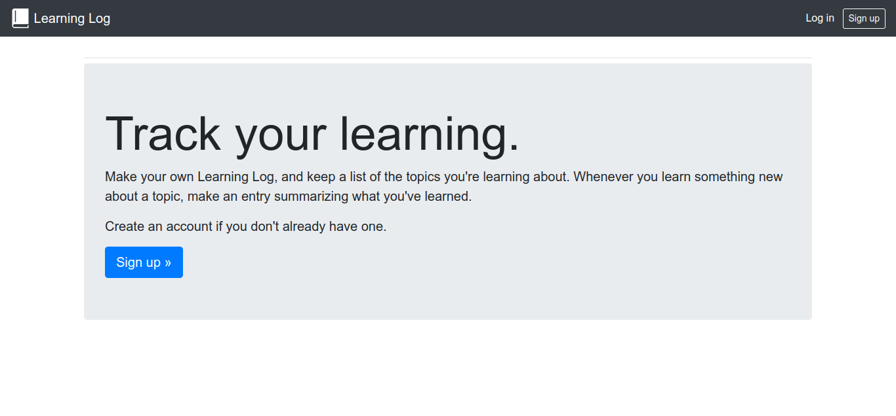
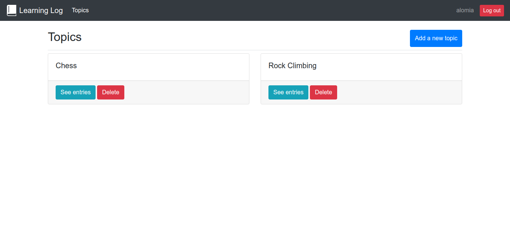
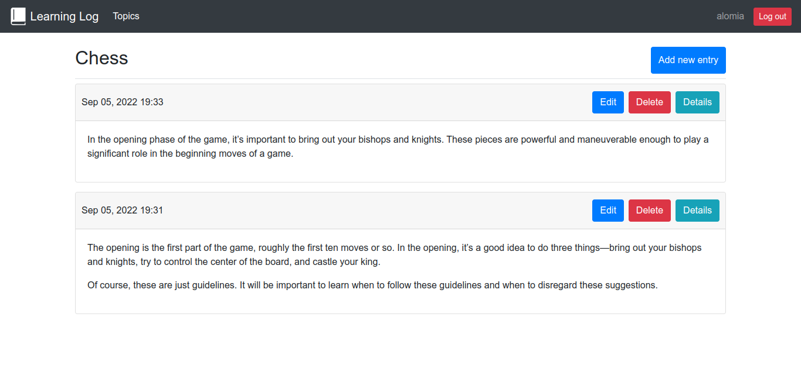

# Learning Log
Web application built with Django, this application consists of making your own Learning Log and keeping a list of the topics you are learning. Every time you learn something new about a topic, you can make an entry summarizing what you have learned.

website: https://alomia-learning-log-app.herokuapp.com/

------

------

------

